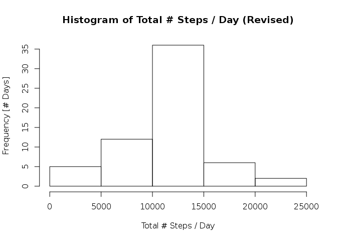

# Reproducible Research: Peer Assessment 1


## Loading and preprocessing the data
1. Load the data (i.e., `read.csv()`)
  
Extract `activity.csv` from `activity.zip`.

```r
unzip(zipfile='activity.zip')
```

Read `activity.csv` into the `activity` data frame.

```r
activity <- read.csv("activity.csv")
```

2. Process/transform the data (if necessary) into a format suitable for your analysis.

Convert `date` field/column to `Date` format.

```r
activity$date <- as.Date(activity$date)
```


## What is mean total number of steps taken per day?
Compute the total number of steps taken per day.  (Missing values are ignored by default.)

```r
total_steps <- aggregate(steps ~ date, activity, sum)$steps
```

1. Make a histogram of the total number of steps taken each day.

```r
hist(total_steps,
     xlab="Total # Steps / Day",
     ylab="Frequency [# Days]",
     main="Histogram of Total # Steps / Day")
```

 

2. Calculate and report the **mean** and **median** total number of steps taken per day.

Calculate the mean total number of steps taken per day.

```r
mean_total_steps <- mean(total_steps)
```

Calculate the median total number of steps taken per day.

```r
median_total_steps <- median(total_steps)
```

The mean total number of steps taken per day is about 10766.19 and
the median total number of steps taken per day is 10765.

## What is the average daily activity pattern?
Compute the average number of steps taken (in 5-minute interval) across all days.

```r
mean_steps_interval <- aggregate(steps ~ interval, activity, mean)
```

1. Make a time series plot (i.e., `type="l"`) of the 5-minute interval (x-axis) and the average number of steps taken, averaged across all days (y-axis).

```r
plot(mean_steps_interval,
     type="l",
     xlab="5-Minute Interval",
     ylab="Average # Steps Across All Days",
     main="Average Daily Activity Pattern")
```

 

2. Which 5-minute interval, on average across all the days in the dataset, contains the maximum number of steps?

```r
max_steps_interval <- mean_steps_interval$interval[which.max(mean_steps_interval$steps)]
```

The 5-minute interval, on average across all days in the dataset, that
contains the maximum number of steps, is 835.

## Imputing missing values
1. Calculate the total number of missing values in the dataset (i.e., the total number of rows with `NA`s).

```r
total_missing_values <- sum(is.na(activity$steps))
```

The total number of missing values in the dataset is 2304.

2. Devise a strategy for filling in all of the missing values in the dataset.  The strategy does not need to be sophisticated.  For example, you could use the mean/medain for that day, or the mean for that 5-minute interval, etc.

Fill in all of the missing values in the dataset using the mean value for that interval.
  
Merge `activity` and `mean_steps_interval`.

```r
activity <- merge(activity, mean_steps_interval, by="interval")
```

Identify the rows with missing values.


```r
rows_na <- is.na(activity$steps.x)
```

3. Create a new dataset that is equal to the original dataset but with the missing data filled in.

Replace missing values with the mean value for that interval.

```r
activity[rows_na, "steps.x"] <- activity[rows_na, "steps.y"]
```

Clean up `activity`.

```r
activity <- activity[,c(1,2,3)]
colnames(activity)[2] <- "steps"
```

4. Make a histogram of the total number of steps taken each day and calculate and report the **mean** and **median** total number of steps taken per day.


```r
total_steps_rev <- aggregate(steps ~ date, activity, sum)$steps

hist(total_steps_rev,
     xlab="Total # Steps / Day",
     ylab="Frequency [# Days]",
     main="Histogram of Total # Steps / Day (Revised)")
```

 

```r
mean_total_steps_rev <- mean(total_steps_rev)

median_total_steps_rev <- median(total_steps_rev)
```

The mean total number of steps taken per day is about 10766.19 and
the median total number of steps taken per day is 10766.19.  The difference compared to the unrevised data are not statistically significant.


## Are there differences in activity patterns between weekdays and weekends?
1. Create a new factor variable in the dataset with two levels -- "weekday" and "weekend" indicating whether a given date is a weekday or weekend day

```r
library(data.table)


activity <- data.table(activity)

weekend = c("Saturday", "Sunday")
activity[, weekday := ifelse(weekdays(date) %in% weekend, "weekend", "weekday")]
```

```
##        interval steps       date weekday
##     1:        0   1.7 2012-10-01 weekday
##     2:        0   0.0 2012-11-23 weekday
##     3:        0   0.0 2012-10-28 weekend
##     4:        0   0.0 2012-11-06 weekday
##     5:        0   0.0 2012-11-24 weekend
##    ---                                  
## 17564:     2355   0.0 2012-10-07 weekend
## 17565:     2355   0.0 2012-10-25 weekday
## 17566:     2355   0.0 2012-11-03 weekend
## 17567:     2355   1.1 2012-10-08 weekday
## 17568:     2355   1.1 2012-11-30 weekday
```

```r
activity[, weekday := as.factor(weekday)]
```

```
##        interval steps       date weekday
##     1:        0   1.7 2012-10-01 weekday
##     2:        0   0.0 2012-11-23 weekday
##     3:        0   0.0 2012-10-28 weekend
##     4:        0   0.0 2012-11-06 weekday
##     5:        0   0.0 2012-11-24 weekend
##    ---                                  
## 17564:     2355   0.0 2012-10-07 weekend
## 17565:     2355   0.0 2012-10-25 weekday
## 17566:     2355   0.0 2012-11-03 weekend
## 17567:     2355   1.1 2012-10-08 weekday
## 17568:     2355   1.1 2012-11-30 weekday
```

2. Make a panel plot containing a time series plot (i.e., `type="l"`) of the 5-minute interval (x-axis) and the average number of steps taken, averaged across all weekday days or weekend days (y-axis).

```r
library(ggplot2)
avg_activity = activity[,list(Avg_step = mean(steps)) , by = list(interval,weekday)]
plt = ggplot(data = avg_activity, aes(x = interval,y = Avg_step)) +
      geom_point() +
      geom_line() +
      facet_wrap(~weekday,ncol=1,scale='free') +
      theme_bw() +xlab('Interval') + ylab('Average Steps')
print(plt)
```

 

In general, the individual seemed to be engaged in higher level of activity during the weekends as compared to the rest of the week.  She appeared to show signs of activity earlier in the day during weekdays (perhaps, she has to wake up earlier for school or work).  Throughout the hours from 0900 hours to 2000 hours, she experiened moderately lower levels of phsyical activity (may be indicative of sedentary school/work) as compared to those same hourse during the weekends.
